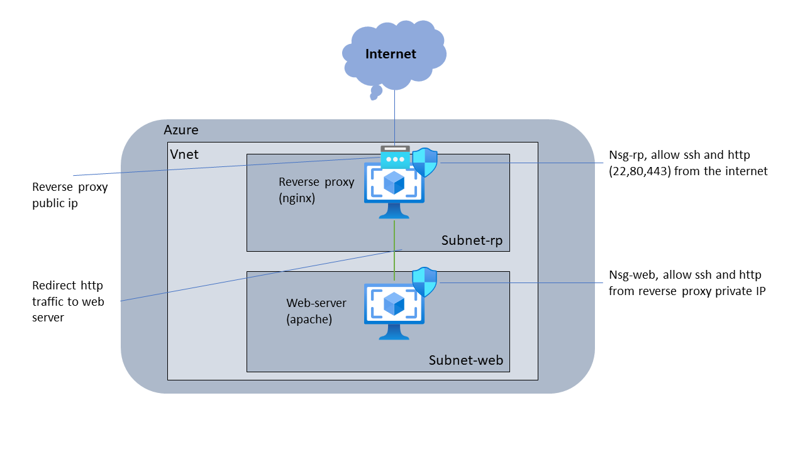

# TerraClope
## What is Terraclope ?
Terraclope is a litte projet in terrafrom to deploy a configured reverse proxy/ web server on azure.

Once terraclope is deployed, a template web site is directly accessible at the ip address gives in the output (reverse-proxy ip).

*This is the archetecture of the Terraclope infrastructure deployed on azure*



## Requirements

1. An azure subscription to deploy in
2. Terraform configured to your azure subscription
3. (not mandatory but better) powershell

## How to deploy
Simply Run this powershell command :

```powershell
./deploy.ps1
```
Then gives the vm's password 

if no powershell available, run this command :
```bash
cd ./terraclope-infra
Terrafrom init
terraform apply -var="reverse_proxy_password=YOUR_PASSWORD_HERE" -var="web_server_password=YOUR_PASSWORD_HERE" --auto-approve
```
Your password must meet azure credential complexity (one lower, one upper, one alphanumeric, one number)

After the terrafrom exection your site is accessible at **http://Public_ip_in_output** 

## How to custom the web template ?
To change de web site, connect to the web-server vm using ssh.
For this we will use the reverse proxy as ssh bounce.
Open a terminal (powershell or unix)

```bash
ssh vmadmin@publicIp
then enter the reverse proxy password you gives at creation
```

Then
```bash
ssh vmadmin@Web-server-private-Ip
then enter the web server password you gives at creation
```

Now to change simply the printed web site go on /var/www/html/ delete the content, and put the web site you want (using git, wget or what ever you want).

Nb : A file named 'index.html' must be present on the folder /var/www/html/

*You can also refert to apache documentation to use a cleaner way to change ;)*

## Security Point
Warring, this architecture is not as secure as it could.
If you want to improve the security you can start by changes this points : 
1. ssh is accessible from the internet on reverse proxy.
2. both vm has ssh authentication via password enabled (should be ssh key)
3. Vm's are not hardened and the os is not at the latest version
4. https is not configured

## Note
This is just a little projet for fun :)
Developped by Maxime BOUDIER